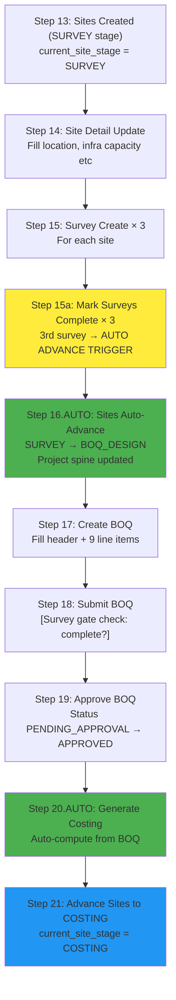

# Survey, BOQ, and Site Infra Data Entry Guide
**After site creation, kaha fill hoga kya data - complete flow**

---

## 1. SURVEY DATA ENTRY
**Stage: SURVEY**  
**Module/Page:** Engineering → Survey  
**Action:** Create GE Survey records for each site

### Data to Fill (Per Site):

```
Survey Date: 2026-05-25
Surveyed By: PM UAT
Linked Site: [auto-populated from site selection]
Linked Project: [auto-populated from site]
Site Name: [auto-populated]
Coordinates: 28.6139,77.2090
Summary: Site accessible, power available, pole mounting feasible, fiber route identified.
```

### Form Fields:
- **Linked Site:** Required - select from dropdown (3 sites)
- **Linked Project:** Auto-filled
- **Linked Tender:** Auto-filled from project
- **Survey Date:** 2026-05-25
- **Surveyed By:** PM UAT (user name)
- **Coordinates:** 28.6139,77.2090
- **Summary:** [Copy per-site summary from UAT_END_TO_END_SAMPLE_FLOW.md]
  - Site 1: "Existing control room available, 20 camera inputs planned, UPS room available."
  - Site 2: "12 pole-mounted cameras, feeder pillar available, trench length approx 180 m."
  - Site 3: "10 cameras, 1 junction box, OFC route via municipal duct, no roadblock."
- **Status:** Starts as "Pending"

### Workflow:
1. Create survey → Status = "Pending"
2. Click "Start Survey" → Status = "In Progress"
3. Fill all details above
4. Click "Mark Completed" → Status = "Completed"
   - **[AUTO TRIGGER]** Backend hook checks: if all surveys complete? YES → Advance all sites SURVEY → BOQ_DESIGN
   - **[AUTO TRIGGER]** Project spine progress recalculated
5. Frontend shows: "✓ Survey marked complete. All surveys done! Sites auto-advancing to BOQ_DESIGN stage..."

**Validation:** After 3rd survey marked complete:
- Run: `/api/surveys/check-complete?project=PROJ-001` → Should return `"complete": true`
- All 3 sites should show: `current_site_stage = BOQ_DESIGN`
- Project should show: `current_project_stage = BOQ_DESIGN`, progress ~15%

---

## 2. SITE INFRASTRUCTURE DATA ENTRY
**Stage: BOQ_DESIGN (after survey completion)**  
**Module/Page:** Project Workspace → Sites Tab → [Site Name] → Infrastructure Section  
**Action:** Fill site-specific infrastructure details

### Data to Fill (Per Site):

```
Tower Count: 1
Fiber Length (m): 180
Backhaul Type: Fiber
Feasibility Status: Approved
Power Source: Grid
Power Available: Yes
Road Accessible: Yes
```

### Form Fields:
- **Tower Count:** 1
- **Fiber Length:** 180 (meter)
- **Backhaul Type:** Fiber (dropdown: Fiber / Wireless / Hybrid)
- **Feasibility Status:** Approved (dropdown: Not Feasible / Feasible with Conditions / Approved)
- **Power Source:** Grid (dropdown: Grid / Solar / Hybrid / Generator)
- **Power Available:** Yes (checkbox)
- **Road Accessible:** Yes (checkbox)
- **Additional Notes:** [Optional]

### Where to Access:
1. Go to: `/projects/[PROJECT-ID]` → Sites tab
2. Click on site name → Site detail panel opens
3. Scroll to "Infrastructure" section
4. Fill the above fields
5. Click "Save" or "Update"

**Note:** This data feeds into:
- Project milestone tracking
- Equipment BOQ calculations
- Procurement feasibility
- Execution planning

---

## 3. BOQ (BILL OF QUANTITIES) DATA ENTRY
**Stage: BOQ_DESIGN (after site infra)**  
**Module/Page:** Engineering → BOQ  
**Action:** Create Engineering BOQ with line items

### BOQ Header Data:

```
BOQ Name: UAT Pilot BOQ v1
BOQ Version: 1
Linked Tender: UAT/TDR/2026/001
Linked Project: [auto-filled after conversion]
Total Scope: Pilot Installation - 3 Sites Deployment
```

### BOQ Line Items (9 items):

| Sr. | Item Name | Quantity | Unit | Rate | Amount |
|-----|-----------|----------|------|------|--------|
| 1 | IPC Dome Camera | 20 | Nos. | 18500 | 370000 |
| 2 | Bullet Camera | 12 | Nos. | 16200 | 194400 |
| 3 | 16 Channel NVR | 3 | Nos. | 42000 | 126000 |
| 4 | 24 Core OFC Cable | 1500 | m | 42 | 63000 |
| 5 | GI Pole 6 Meter | 8 | Nos. | 14500 | 116000 |
| 6 | UPS 5 KVA | 2 | Nos. | 68000 | 136000 |
| 7 | Network Switch 24 Port | 4 | Nos. | 28500 | 114000 |
| 8 | Installation & Commissioning | 1 | Lot | 850000 | 850000 |
| 9 | O&M Support Year 1 | 1 | Lot | 1200000 | 1200000 |
| | | | | **TOTAL** | **35,200,000** |

### Form Fields:
- **BOQ Name:** UAT Pilot BOQ v1
- **BOQ Version:** 1 (auto-incremented if duplicate)
- **Linked Tender:** UAT/TDR/2026/001 (select)
- **Linked Project:** [auto-filled]
- **Scope Description:** Pilot Installation - 3 Sites Deployment
- **Line Items Table:** Add 9 rows with above data

### Step Actions:

**Step 1: Create BOQ**
1. Go to: Engineering Module → BOQ
2. Click "New"
3. Fill header fields
4. Add 9 line items in table
5. Save → Status = "DRAFT"

**Step 2: Submit BOQ for Approval**
1. On BOQ detail page, click "Submit"
2. Triggers validation: `validate_survey_gate()` 
   - Checks: Are all surveys Completed? YES → Allow submit
3. Change Status: "DRAFT" → "PENDING_APPROVAL"
4. Create accountability trail entry

**Step 3: BOQ Approval (Approver role)**
1. Navigate to BOQ in approval queue OR go to BOQ directly
2. Click "Approve"
3. Status: "PENDING_APPROVAL" → "APPROVED"
4. Now BOQ is locked & ready for procurement

**Step 4: Auto-Trigger - Costing & Procurement**
After BOQ approval:
- System auto-computes costing breakdown
- Creates procurement line items
- Advances project spine to COSTING stage

---

## Data Entry Sequence (End-to-End)



---

## Form Access Paths

| Data Type | Module Path | Form Type | Status After Create |
|-----------|------------|-----------|-------------------|
| Survey | Engineering → Survey | GE Survey | Pending |
| Site Infra | Project Workspace → Sites → [Site] | GE Site (infra section) | N/A (embedded) |
| BOQ | Engineering → BOQ | GE BOQ | Draft |
| BOQ Approval | Workflow | GE BOQ (action button) | Pending Approval |
| BOQ Approval | Approval Queue or direct link | GE BOQ (action button) | Approved |

---

## Field Mapping to Sample Data

### From UAT_END_TO_END_SAMPLE_FLOW.md:

**Survey Data Section:**
```
Source: Lines 116-142 in UAT_END_TO_END_SAMPLE_FLOW.md
Copy → Survey form fields
```

**Site Infra Sample Section:**
```
Source: Lines 143-150 in UAT_END_TO_END_SAMPLE_FLOW.md
Copy → Site detail infrastructure form
```

**BOQ Sample Section:**
```
Source: Lines 151-163 in UAT_END_TO_END_SAMPLE_FLOW.md
Copy → BOQ header fields

Suggested BOQ line items (Lines 164-172):
Copy → BOQ line items table
```

---

## Validation Checkpoints

### After Survey Mark Complete:
```bash
# Check all surveys completed
GET /api/surveys/check-complete?project=PROJ-001
Response: { "complete": true, "completed": 3, "total": 3 }

# Verify site stage advanced
GET /api/project-workspace?method=get_project&args={"project": "PROJ-001"}
Response: sites[*].current_site_stage = "BOQ_DESIGN"

# Check project spine progressed
GET /api/project-workspace?method=get_project_spine_detail&args={"project": "PROJ-001"}
Response: project.spine_progress_pct ≈ 15%
```

### After BOQ Submit:
```bash
# BOQ should reach approval queue
GET /api/boq-approvals?status=pending
Response: Should list submitted BOQ

# Accountability trail logged
GET /api/accountability?subject_doctype=GE%20BOQ&subject_name=UAT-BOQ-001
Response: Entry for "SUBMITTED" event
```

### After BOQ Approve:
```bash
# BOQ marked as APPROVED
GET /api/boq?name=UAT-BOQ-001
Response: { "status": "APPROVED", "total_amount": 35200000 }

# Project spine auto-advanced (check in background)
# (Depends on automation rules - may need manual trigger for Step 20)
```

---

## Common Issues & Fixes

### Issue 1: Survey Complete but Site Stage Not Advanced
**Cause:** Incomplete trigger or backend hook not fired  
**Action:** 
- Check survey status: `GET /api/surveys?linked_project=PROJ-001`
- Verify all are "Completed"
- If not all complete, mark remaining ones
- Monitor backend logs for on_update hook

### Issue 2: BOQ Submit Rejected - Survey Gate Failed
**Cause:** Not all surveys marked Completed  
**Action:**
- Go to Engineering → Survey
- Mark any "In Progress" surveys as "Completed"
- Re-submit BOQ

### Issue 3: Site Infra Data Not Persisting
**Cause:** Saved but not committed (if manually editing via API)  
**Action:**
- Use UI form save button (auto-commits)
- Or ensure `frappe.db.commit()` in API

---

## Next Steps After Data Entry

After BOQ Approval (Step 19):
1. **Step 20:** Vendor Comparison creation (Procurement module)
2. **Step 21:** PO creation from vendor selection
3. **Step 22:** GRN/Inventory receipt tracking
4. **Step 23:** Execution & Commissioning
5. **Step 24:** Closure & O&M Transition

See: `UAT_END_TO_END_SAMPLE_FLOW.md` for full workflow continuation.
